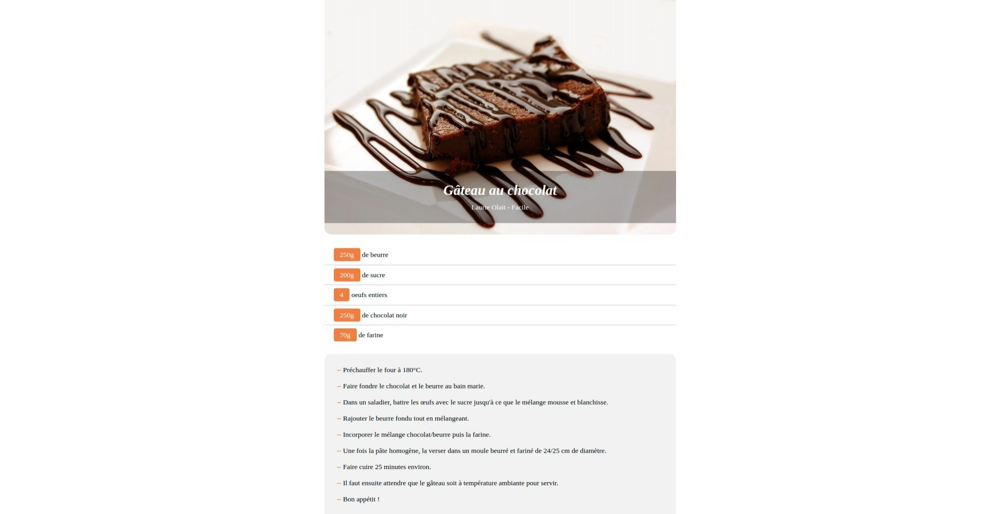

# REACT-JS- Recette gateau au chocolat

Pour les gourmands, une page 'recette de gâteau au chocolat' réalisée avec React JS :yum:

## Étapes de la réalisation

- Intégration statique: JSX, SCSS.
- Dynamisation de l'affichage des 3 composants et du sous-composant (affichage d'un ingrédient) avec les props React :tada:

## Capture d'écran

